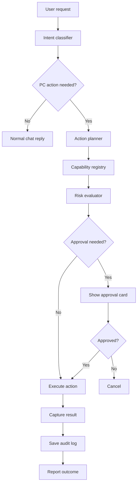

# Jarvis-Style Command Control Plan

Live Runtime should become a local desktop operator through a controlled action layer, not through unrestricted command execution.

## Goal

The assistant should be able to:

- open apps, folders, files, and URLs
- search local files after permission
- run approved project tasks such as build, test, and dev scripts
- start or stop local services such as Ollama
- manage the companion window
- remember repeated workflows and convert them into reusable skills

## Core rule

The model should never execute raw shell text directly. It should propose a typed action. The native runtime should validate the action, check policy, ask for approval when needed, execute it, and log the result.

## Architecture



## Capability registry

Use a typed allowlist of actions:

```ts
openApp(input)
openUrl(input)
openFile(input)
revealPath(input)
listDirectory(input)
searchFiles(input)
runProjectTask(input)
getRuntimeInfo(input)
startLocalService(input)
stopLocalService(input)
focusWindow(input)
resizeCompanion(input)
```

Each capability should define:

```ts
id
name
description
inputSchema
riskLevel
requiresConfirmation
platforms
timeoutMs
```

## Risk levels

```text
safe     read-only or UI-only actions
medium   app launches, local service starts, known project scripts
high     file writes, dependency installs, git changes
critical destructive or system-level changes
```

Execution rules:

- safe actions can run directly
- medium actions can be approved once per session
- high actions require explicit confirmation
- critical actions require a stronger confirmation flow

## Audit log

Every action should be stored locally:

```ts
ActionLog {
  id: string;
  timestamp: string;
  source: "chat" | "routine" | "skill";
  capabilityId: string;
  inputSummary: string;
  riskLevel: string;
  approved: boolean;
  outputSummary: string;
  exitCode?: number;
}
```

## UI changes

Add a dashboard page named `Control`.

It should include:

- pending approval cards
- recent actions
- enabled capabilities
- blocked actions
- permission settings
- emergency stop button

## MVP phases

### Phase 1: Safe desktop actions

- open app
- open URL
- open folder or file
- reveal path in file manager
- show confirmation UI
- save action logs

### Phase 2: Developer actions

- run approved package scripts
- run approved build/test commands
- open repo in editor
- start or stop Ollama
- capture process output

### Phase 3: Window and workflow control

- focus app window
- move or resize companion
- summarize visible runtime errors after permission
- create reusable workflow buttons

### Phase 4: Jarvis interaction mode

- push-to-talk or wake-word style input
- interruptible TTS
- command preview while listening
- local notifications
- task queue with pause and cancel

### Phase 5: Skill memory

- detect repeated approved workflows
- convert workflows into editable skills
- store project-specific skills in memory
- retrieve skills when a similar request appears

## Recommended UX

For medium or high-risk actions, the assistant should preview the plan before execution:

```text
Planned actions:
1. Open the project folder
2. Run the selected dev script
3. Watch logs for errors

Risk: medium
Approve?
```

For critical actions, require a stronger confirmation phrase and show exactly what will change.

## Native implementation files

Suggested Tauri modules:

```text
src-tauri/src/actions.rs
src-tauri/src/permissions.rs
src-tauri/src/audit.rs
src-tauri/src/shell.rs
src-tauri/src/windows.rs
```

Suggested commands:

```rust
list_capabilities()
preview_action(action)
run_action(action)
cancel_action(action_id)
list_action_logs()
clear_action_logs()
```

## Final design principle

The AI plans. The runtime enforces. The user approves risky actions. The audit log records everything.
