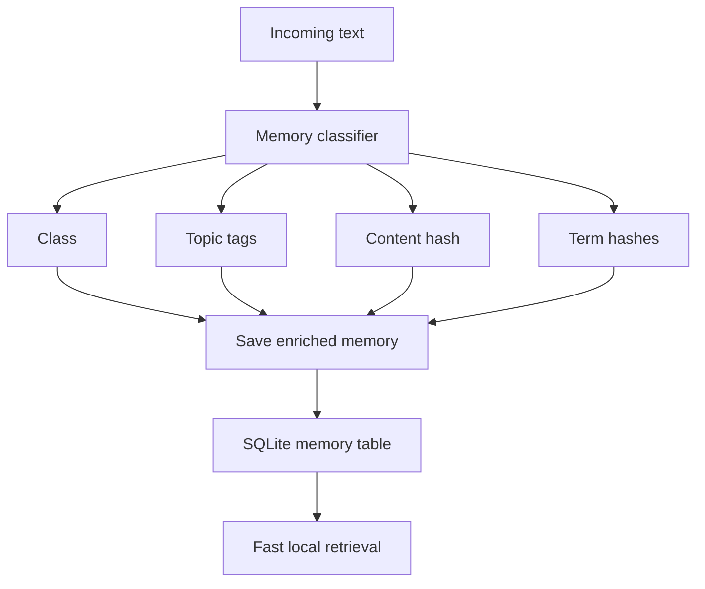
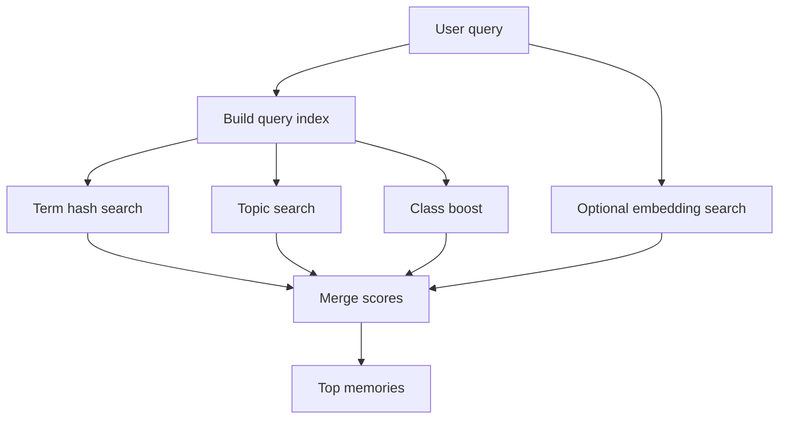

# Memory-History Classifier

Live Runtime uses a routing layer before saving memory. The goal is to avoid treating every message the same way.

## Flow



## Classes

The first version supports:

```text
chatHistory      normal conversation context
preference       stable user preference
projectMemory    repo, branch, UI, bug, architecture decisions
actionRequest    user asks the assistant to do something
skillCandidate   repeated workflow that can become a reusable skill
```

## Topics

The classifier also adds lightweight topic tags:

```text
memory
voice
pc-control
ui
repo
local-models
```

## Indexes

Each saved memory gets:

```text
memoryClass
contentHash
searchHashes
topic tags
class tags
term hash tags
```

The hash index is cheap and local. It lets retrieval work quickly even when the embedding model is unavailable or slow.

## Retrieval order



## Design rule

Embeddings should improve recall, but the app should still feel fast without them. The classifier/hash index is the baseline. Vectors are the upgrade layer.
