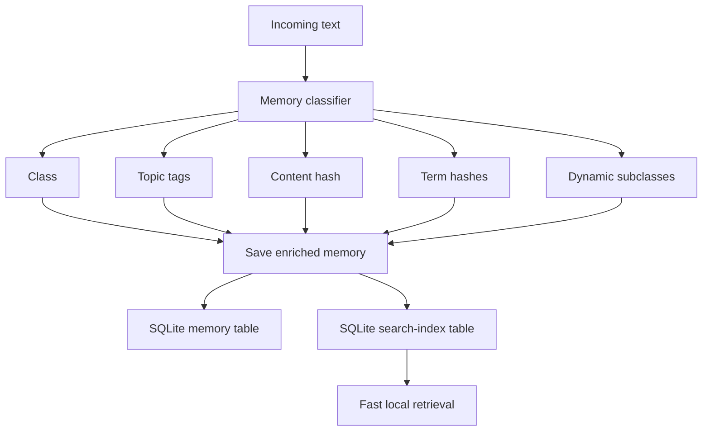
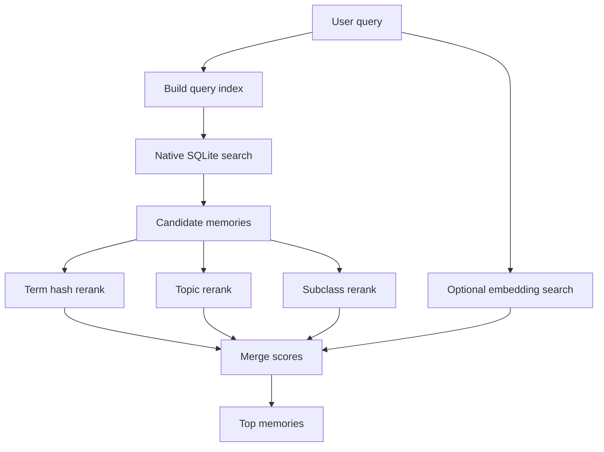

# Memory-History Classifier

Live Runtime uses a routing layer before saving memory. The goal is to avoid treating every message the same way.

## Flow



## Classes

The stable classes are:

```text
chatHistory      normal conversation context
preference       stable user preference
projectMemory    repo, branch, UI, bug, architecture decisions
actionRequest    user asks the assistant to do something
skillCandidate   repeated workflow that can become a reusable skill
```

## Dynamic subclasses

The classifier also adds controlled dynamic subclasses for recurring areas:

```text
memory-indexing
companion-ui
voice-config
pc-control
repo-workflow
local-model-runtime
```

These are not uncontrolled model-generated labels. They are deterministic expansion hints used to improve retrieval precision while keeping the main class enum stable.

## Topics

The classifier adds lightweight topic tags:

```text
memory
voice
pc-control
ui
repo
local-models
auto-* dynamic topics
```

## Indexes

Each saved memory gets:

```text
memoryClass
contentHash
searchHashes
topic tags
class tags
subclass tags
term hash tags
```

The hash index is cheap and local. It lets retrieval work quickly even when the embedding model is unavailable or slow.

## DB-level search

New memories are also written into a normalized SQLite table:

```text
memory_search_index
  memory_id
  token
  kind
  created_at
```

The dashboard sends query term hashes, topics, stable classes, and dynamic subclasses to the native `search_memories` command. SQLite returns a small candidate set first. The dashboard then reranks that candidate set with lexical scores and optional embeddings.

## Retrieval order



## Evaluation

Classifier behavior is covered by deterministic fixtures in:

```text
packages/core/src/memory/classifier.test.ts
```

Run:

```bash
npm run test:classifier --workspace @live-runtime/core
```

The fixtures check stable classes, dynamic subclasses, topics, content hashes, and term hashes.

## Design rule

Embeddings should improve recall, but the app should still feel fast without them. The classifier/hash index is the baseline. Vectors are the upgrade layer.
